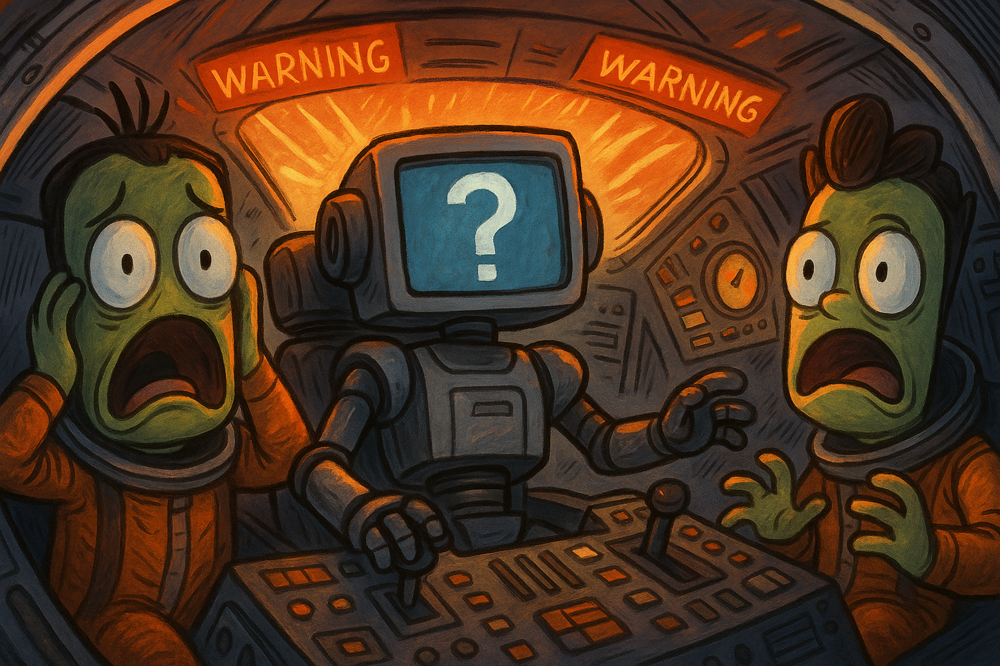

# GeePT MCP — Kerbal Mission Command Protocol



## Introduction

"Computer, fly me to Orbit!"
- a Kerbal's last words

You always dreamed of having an agent autonomously control your spaceship? No more need to fly boring standard maneuvers like orbital insertion, or rendezvousing? Let the AI do them! 

The **GeePT MCP (Kerbal Mission Command Protocol)** transforms Kerbal Space Program into a remote‑controlled playground for AI agents and human operators.  By combining [kRPC](https://krpc.github.io/krpc/) with a rich set of mission tools, it lets your LLM:

- write and execute kRPC Python scripts inside your live KSP game, effectively taking control of your flight*.
- Inspect your vessel’s blueprint, part tree, stages and engines, to have an overview of what kind of bent bird you're flying.
- Conveniently search and retrieve pages from the KSP Wiki, as well as the official kRPC documentation, and kRPC community code snippets for best practices.
- Access playbooks and guides that teach agents how to read blueprints and plan safe staging and burns.

*Successful flights cannot be guaranteed

## Quick start

1. **Install dependencies**

   This project requires Python 3.10+ and [uv](https://github.com/astral-sh/uv) for running scripts and managing dependencies.

   ```sh
   # Clone the repository
   git clone https://github.com/G4ertner/geept_mcp.git
   cd geept_mcp

   # Use uv to run the MCP server
   curl -LsSf https://astral.sh/uv/install.sh | sh  # install uv
   uv pip install -e .[krpc]  # install dependencies with krpc extras
   ```

2. **Launch the MCP server**

   In one terminal, start Kerbal Space Program and enable the kRPC server (Protobuf over TCP).  Note the address and ports shown in the kRPC window.  In another terminal, run:

   ```sh
   # from the repo root
   uv run -m mcp_server.main
   ```

   The server will listen for incoming requests over stdio (for Codex integration) and handle script execution and tool calls.

3. **Register with Codex CLI (optional)**

   If you use [Codex CLI](https://github.com/openai/openai-codex-cli), add the MCP server so it can be launched on demand:

   ```sh
   codex mcp add geept_mcp -- uv run -m mcp_server.main --transport stdio --with krpc 
   ```

4. **Connect to your game**

   When calling tools that interact with the game (execute scripts, fetch blueprints, etc.), provide the address and ports of your running KSP instance.  For example:

   ```
   Use krpc_docs to execute_script with code "print('hello'); print('SUMMARY: done')" and address "192.168.1.10" rpc_port 50000 stream_port 50001
   ```

## Data builders (kRPC docs & snippet library)

The runtime MCP server now lives alongside two standalone builder projects under `krpc_MCP_data_builders/`:

- `krpc_docs/` contains the crawler (`scripts/scrape_krpc_docs.py`) and search CLI for regenerating `data/krpc_python_docs.jsonl`. Install it with `pip install -e .[scrape]` inside that folder and run the provided console scripts. Copy the resulting JSONL back into `./data/` when you refresh the dataset.

Each builder has its own `pyproject.toml`, README, and duplicated helper modules so it can run independently before you move it into a separate repository.

### MCP server layout

- `mcp_server/main.py` - wires up the FastMCP server and imports all tool/resource surfaces.
- `mcp_server/executor_tools/` - execute_script implementations, background jobs, and artifact helpers (exposed via `mcp_server/executor_tools.py`).
- `mcp_server/libraries/` + `mcp_server/libraries.py` - kRPC docs search, KSP wiki access, and snippet tooling with the public MCP entry points.
- `mcp_server/general_tools.py` - tool entry points grouped by category; implementations live under `mcp_server/general_tools_impl/`.
- `mcp_server/playbooks/` + `mcp_server/playbooks.py` - markdown playbooks served as MCP resources.
- `mcp_server/utils/` - shared helpers (`krpc_utils`, `helper_utils`, `physics_utils`, etc.) used across the server packages.

### Tool runtime behavior (timeouts)

- Sync tools now run off the event loop in a worker thread with a 60s hard cap to avoid freezing the server when kRPC hangs.
- Long-running job starters (`start_part_tree_job`, `start_stage_plan_job`, `start_execute_script_job`) and `execute_script` are exempt; they rely on their own watchdogs.
- If a tool might exceed 60s (e.g., part tree/stage plan), prefer the start_* job variants to stream logs and stay responsive.

## Core capabilities

### 🛰️ Live script execution

The `execute_script` tool allows your LLM to run kRPC Python code against your running game. with its pre-setup there is no need to worry your LLM will successfully connect to your game. The MCP server automatically injects useful globals:

- `conn`: your live kRPC connection
- `vessel`: the active vessel (or `None` if you’re not in flight)
- `time`, `math`, `sleep`, `deadline` and `check_time()` helpers
- a preconfigured `logging` module and a `log(msg)` convenience function
- A status summary of flight variables after successful execution or catastrophic failure

Additionally, the game will automatically pause after the execution of each script, ensuring that nothing unforeseen happens while your LLM keeps on planning the next step. For burns that need more than ~60 s of supervision, use `start_execute_script_job` instead: it streams stdout/stderr into `get_job_status`, lets you alternate those polls with `get_status_overview`/`get_flight_snapshot`, and can be aborted instantly via `cancel_job(job_id)` if telemetry goes sideways. If the rocket disintegrates or you revert while the job is running, the runner now notices the missing `active_vessel`, aborts immediately, and returns `ok=false` so you can treat the crash as a failure instead of spinning forever.

### 🛠️ Vessel blueprints & diagrams

Need your LLM to inspect your craft? The blueprint tools expose:

- `get_vessel_blueprint`: returns a JSON blueprint with metadata, stages, engines and parts.
- `get_part_tree`: returns a hierarchical list of all parts with parent/child relationships, modules and resources.
- `get_blueprint_ascii`: produces a LLM-readable per‑stage summary of the vessel.
- `get_stage_plan`: provides a stock-like stage plan (thrust, Isp, Δv).
- `get_staging_info`: returns per-stage Δv/TWR estimates.
- `export_blueprint_diagram`: generates a diagram (SVG or PNG) of your vessel’s staging and structure.  

These tools let your LLM understand the craft’s structure, plan staging and fuel usage to generate vessel specific flight plans and mission profiles

### 📚 KSP Wiki, kRPC docs search, and community example snippets search

The MCP server wraps the MediaWiki API and the locally indexed kRPC documentation.  Tools include:

- `search_ksp_wiki(query, limit)`, `get_ksp_wiki_page(title, max_chars)` and `get_ksp_wiki_section(title, heading, max_chars)` for looking up game concepts (e.g. delta‑v, maneuver nodes, ISRU).  Perfect for agents that need domain knowledge.
- `search_krpc_docs(query, k)` and `get_krpc_doc(url, max_chars)` for searching and retrieving the kRPC Python API reference without leaving chat.
- `snippets_search`, `snippets_get`, `snippets_resolve`, and `snippets_search_and_resolve` allows your LLM to get the best examples for kRPC code from 11 most popular kRPC public repos.

### 📖 Playbooks & guidance

The server ships with severeal playbooks to give your LLM a headstart on how to use the MCP's tools and execute common maneuvers:

get_maneuver_node_playbook - (resource://playbooks/maneuver-node)
get_blueprint_usage_playbook - (resource://playbooks/vessel-blueprint-usage)
get_flight_control_playbook - (resource://playbooks/flight-control)
get_rendezvous_playbook - (resource://playbooks/rendezvous-docking)
get_launch_ascent_circ_playbook - (resource://playbooks/launch-ascent-circularize)
get_state_checkpoint_playbook - (resource://playbooks/state-checkpoint-rollback)
get_orbital_return_playbook - (resource://playbooks/orbital-return-playbook)
get_scribe_master_prompt_resource - (resource://prompts/scribe-master)
get_latest_staging - (resource://staging/latest)
get_latest_vessel_blueprint - (resource://vessel-blueprint/latest)
get_last_svg - (resource://blueprints/last-diagram.svg)
get_last_png - (resource://blueprints/last-diagram.png)
get_snippets_usage — (resource://snippets/usage)

### Additional Tools

On top of that, the MCP server comes with a whole set of hardcoded tools your LLM can easily call to interact with the game. This avoids your LLM having to write out code for simple commands.

### User injection messages

- Start the server in streamable HTTP mode when you want to accept injection messages over HTTP: `uv run -m mcp_server.main --transport streamable-http --host 0.0.0.0 --port 8000`.
- Post messages to `POST /runs/<run_id>/inject` with a JSON body like `{ "message": "Warn me if TWR drops" }`. The next tool response for that run will append `User injection message: ...` once. Streamable HTTP clients can reuse their `mcp-session-id` header as `run_id`; stdio use cases can target the default run id `default`.
- A helper UI is available at `uv run -m mcp_server.injection_ui --run-id <run_id> [--server-url http://127.0.0.1:8000]` for quickly typing and sending messages. When in Streamable HTTP mode, you can simply pass `--run-id default`; if no session-specific message is queued, the default queue will be applied to the next tool call for any session.

#### 🧭 Connection & Save Management
- `krpc_get_status` — Checks connectivity to kRPC and reports version.
- `save_llm_checkpoint` — Creates a namespaced save (non-quicksave).
- `load_llm_checkpoint` — Loads a named save (LLM-prefixed by default).
- `quicksave`, `quickload`, `revert_to_launch` — Manage flight and revert states.

#### 🚀 Launch & Vessels
- `launch_vessel` — Launches a craft from VAB/SPH at a site.
- `list_launchable_vessels` - Lists craft available in VAB/SPH.
- `list_launch_sites` - Lists available launch sites.
- `list_vessels` - Lists vessels in the save.

#### 🧠 Script Jobs & Control
- `start_execute_script_job` - Run execute_script as a cancellable job with live log streaming; alternate get_job_status with vessel status checks to monitor the burn.
- `get_job_status` - Poll any background job (part tree, stage plan, script, etc.) for live logs and the result_resource URI.
- `cancel_job` - Abort a running job (kill a script mid-flight) before reverting/loading checkpoints.

**Script job workflow:** start the job, loop on `get_job_status(job_id)` to read logs, interleave those polls with situational tools (`get_status_overview`, `get_flight_snapshot`, etc.), and if telemetry looks wrong call `cancel_job(job_id)` immediately and revert/load before continuing.

#### 🌍 Bodies & Waypoints
- `list_bodies` — Lists celestial bodies with key metadata.
- `list_waypoints` — Lists waypoints with location and range/bearing.


#### 🧾 Status & Time
- `get_status_overview` — Combined snapshot of vessel/game state.
- `get_vessel_info` — Basic vessel info (name, mass, throttle, situation).
- `get_time_status` — Universal and mission time.

#### 🌡️ Environment & Surface
- `get_environment_info` — Body/environment data including gravity and atmosphere.
- `get_surface_info` — Surface coords, terrain height, slope, ground speed.

#### 🛩️ Flight & Control
- `get_flight_snapshot` — Flight parameters (altitude, speeds, AoA, attitude).
- `get_attitude_status` — SAS/RCS/throttle, SAS mode, and autopilot targets.
- `set_sas_mode` — Enable SAS and pick navball hold mode (prograde/retrograde/etc.).
- `get_action_groups_status` — Action group toggles.
- `get_camera_status` — Camera mode and parameters.
- `get_screenshot` — Captures a PNG screenshot (localhost-only), saves it under `artifacts/screenshots/`, and returns base64 + a reusable resource URI (or `resource://screenshots/latest`).

#### 🌬️ Aerodynamics & Engines
- `get_aero_status` — Dynamic pressure, Mach, density, drag/lift.
- `get_engine_status` — Per-engine thrust, Isp, throttle, flameout.

#### ⚡ Power & Resources
- `get_power_status` — EC totals, production/consumption, notes.
- `get_resource_breakdown` — Vessel and stage resource totals.

#### 🧱 Blueprints, Parts & Staging
- `get_vessel_blueprint` — Idealized craft blueprint (stages, engines, parts).
- `get_blueprint_ascii` — Compact ASCII stage summary with Δv/TWR.
- `get_part_tree` — Hierarchical part tree with resources.
- `get_stage_plan` — Stock-like stage plan (thrust, Isp, Δv).
- `get_staging_info` — Per-stage Δv/TWR estimates.
- `export_blueprint_diagram` — Exports a 2D blueprint diagram (SVG/PNG).
- `start_part_tree_job` / `start_stage_plan_job` - Kick off background jobs that produce the same JSON artifacts without hitting tool timeouts.
- `get_job_status` - Polls job state/logs and exposes the `result_resource` URI once the artifact is ready.

**Background job workflow (long-running tooling)**
1. Call a start_*_job tool with the usual kRPC address/ports; it responds with { job_id, status, note }.
2. Poll get_job_status(job_id) until status becomes "SUCCEEDED" (or "FAILED" for troubleshooting). Logs accumulate while the job runs.
3. When the job succeeds, call read_resource on the reported `result_resource` (e.g., `resource://jobs/<id>.json`) to download the artifact.
4. Use the artifact in your planning loop. If the job failed, read the logs/error, fix the underlying issue, and restart the job.


#### 🪐 Orbit & Navigation Info
- `get_orbit_info` — Orbital elements and periods.
- `get_navigation_info` — Navigation context relative to target.
- `get_targeting_info` — Current target summary.

#### 🎯 Target Control
- `set_target_body` — Sets target body.
- `set_target_vessel` — Sets target vessel by name.
- `clear_target` — Clears current target.

#### 🔭 Maneuver Nodes
- `list_maneuver_nodes` — Lists basic maneuver nodes.
- `list_maneuver_nodes_detailed` — Detailed node vectors and burn estimate.
- `set_maneuver_node` — Creates a node at UT with vector.
- `update_maneuver_node` — Edits an existing node.
- `delete_maneuver_nodes` — Removes all maneuver nodes.
- `warp_to` — Warps to a UT with optional lead time.

#### 🧠 Planning Helpers (Burns & Transfers)
- `compute_burn_time` — Estimates burn time for Δv.
- `compute_circularize_node` — Proposes circularization at Ap/Pe.
- `compute_raise_lower_node` — Proposes Ap/Pe change to a target altitude.
- `compute_transfer_window_to_body` — Computes Hohmann transfer window.
- `compute_ejection_node_to_body` — Coarse ejection burn from parking orbit.
- `compute_plane_change_nodes` — Plane-change burns at AN/DN.
- `compute_rendezvous_phase_node` — Phasing orbit for rendezvous.

#### ⚓ Docking
- `list_docking_ports` — Lists docking ports and states.

---

> 🥪 **Experimental**: This project is under active development.  Use at your own risk and feel free to open issues or PRs if you encounter problems or have suggestions.
